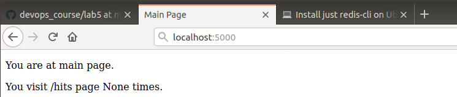

## Lab_5: Автоматизація за допомогою Makefile VS Docker Compose
### Посилання
+ [Docker Repository](https://hub.docker.com/repository/docker/yuriiurshanskyi/flask)


### Хід роботи

Запускаємо файл app.py
```
pipenv --python 3.8
pipenv install -r requirements.txt
pipenv run python app.py
```
Результат виконання:  



Тестування:

