## Lab_5: Автоматизація за допомогою Makefile VS Docker Compose
### Посилання
+ [Docker Repository](https://hub.docker.com/repository/docker/yuriiurshanskyi/flask)


### Хід роботи

Запускаємо файл app.py
```
pipenv --python 3.8
pipenv install -r requirements.txt
pipenv run python app.py
```
Результат виконання:  
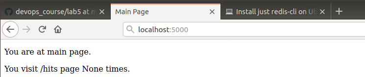  
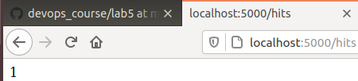  
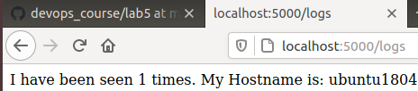  

Тестування:
```
pipenv run pytest test_app.py --url http://localhost:5000
```
Тести пройшли успішно

Директиви Makefile:  
+ .PHONY - задаємо псевдоціль  
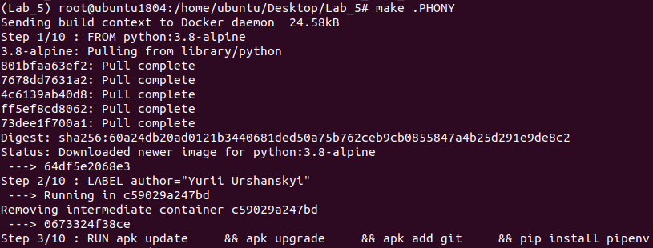  
+ run - запуск  
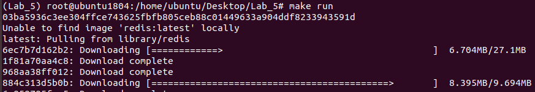  
+ test-app - тестування  
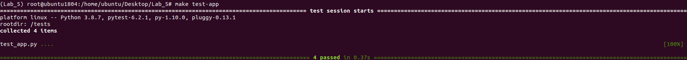  
+ docker-prune - очищає Docker  
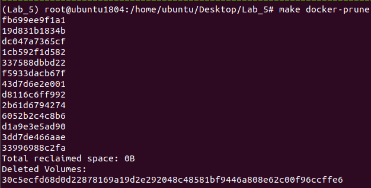  


Виконуємо `make docker-push`  
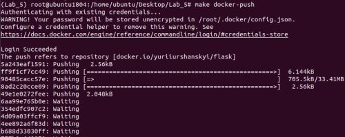  
Виконуємо `make docker-wipe`  


Перевіряємо версію `docker-compose version`    
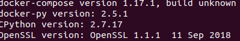  
`docker-compose -p Flask up`  
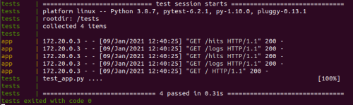  

Запущений додаток на compose:  
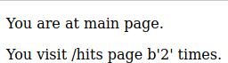  
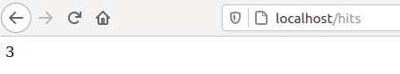  
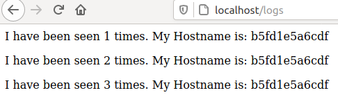  

`docker-compose push` - завантажуємо імеджі  
В даному випадку `docker-compose` є кращим за `Makefile`, адже ми працюємо з `Docker`  

`docker-compose -p Django up`  
Демонстрація запуску:  
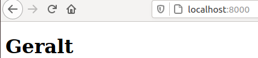  
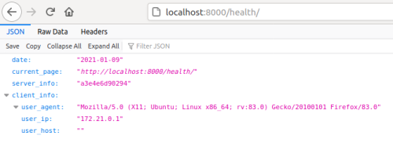  
