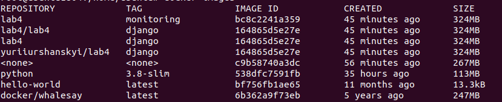
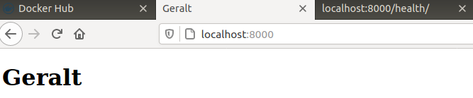
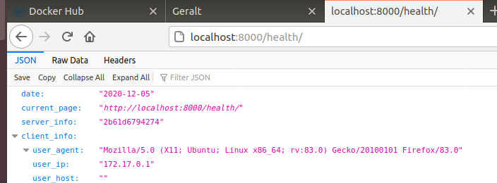

## Lab_4: Робота з Docker

#### Докер ID [Link](https://hub.docker.com/u/yuriiurshanskyi)
#### Докер Repository [Repository](https://hub.docker.com/repository/docker/yuriiurshanskyi/lab4)

__Демонстрація роботи__





#### Створення файлу `my_work.log`
```
docker -v >> my_work.log;
docker --help >> my_work.log;
docker run docker/whalesay cowsay Docker is fun >> my_work.log;
```

#### Завантаження `python 3.8` імеджу
```
docker pull python:3.8-slim
```
#### Для перевірки наявних імеджів використовуємо команду
```
docker images
```
#### Білд основного імеджу
```
docker build -t yuriiurshanskyi/lab4:django -f Dockerfile .
```
#### Білд моніторинг імеджу
```
docker build -t yuriiurshanskyi/lab4:monitoring -f Dockerfile.monitoring .
```
#### Запуск імеджів
```
docker run -it -p 8000:8000 yuriiurshanskyi/lab4:django
docker run -it yuriiurshanskyi/lab4:monitoring
```
#### Завантаження імеджів
```
docker login
docker push yuriiurshanskyi/lab4:django
docker push yuriiurshanskyi/lab4:monitoring
```
#### Створення docker тому, монтування його до імеджу

docker volume create yuriiurshanskyi

docker run -it --net=host --volume yuriiurshanskyi:/app yuriiurshanskyi/lab4:monitoring
